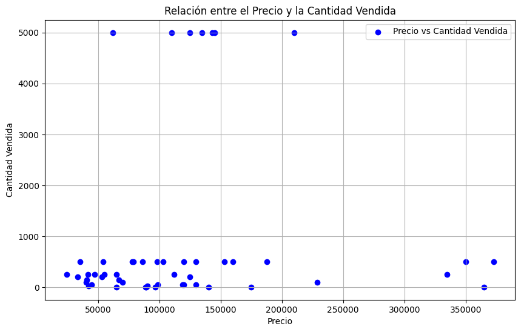
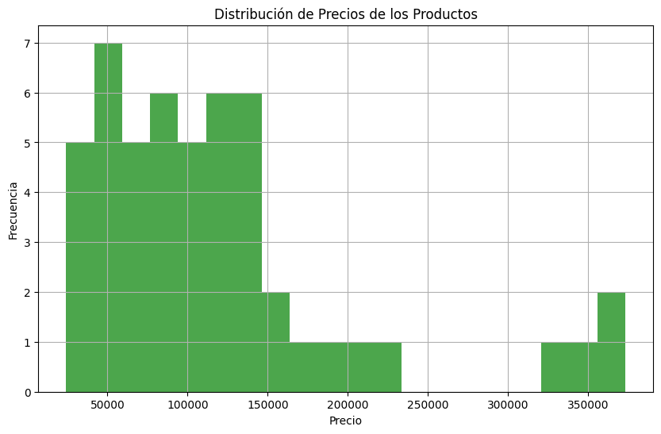
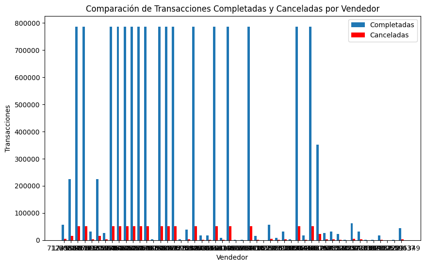
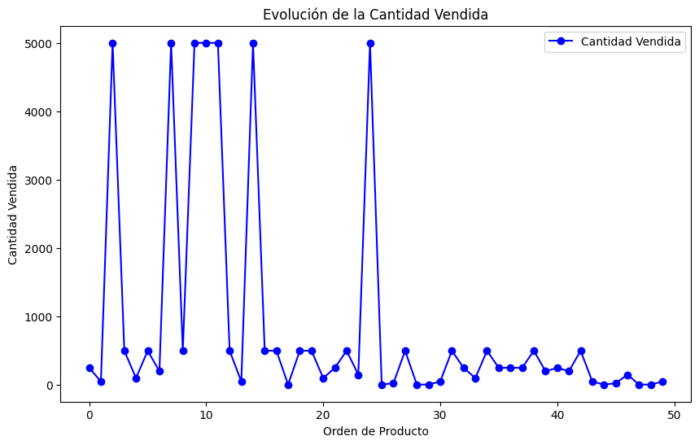
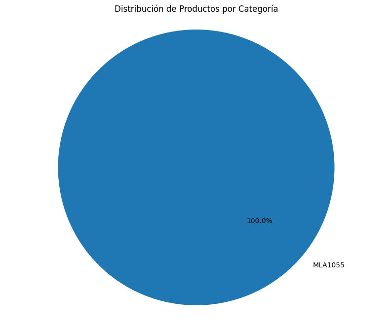
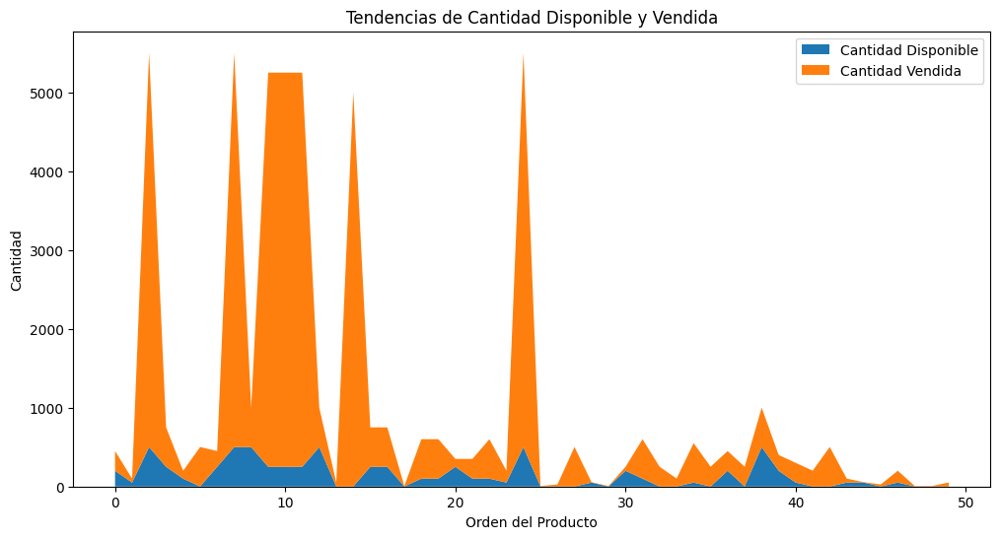
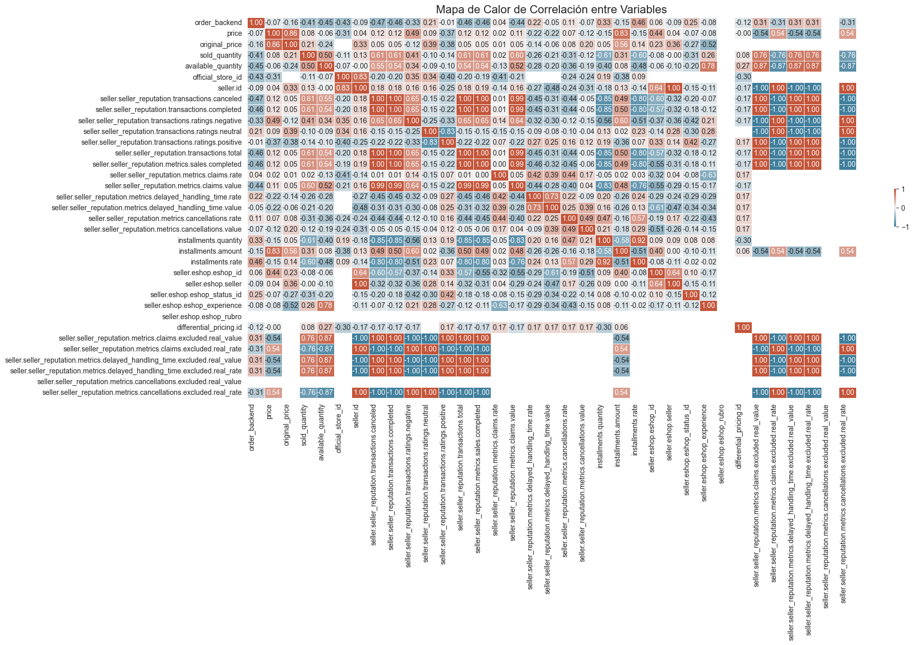
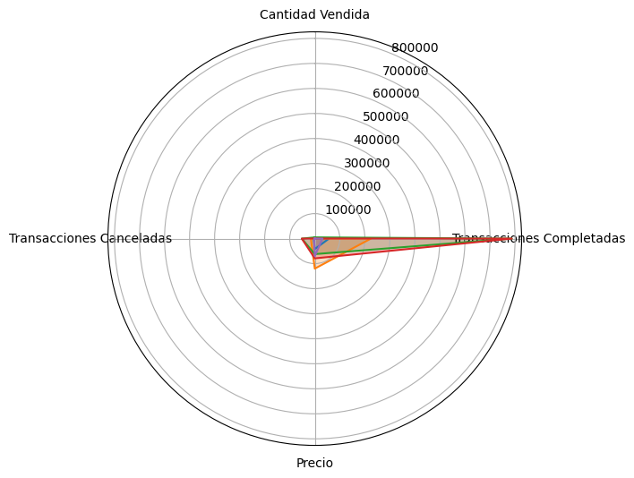

# Informe de Análisis de MercadoLibre

Este documento presenta un resumen del análisis realizado sobre los datos de productos obtenidos de la API de MercadoLibre.

## Contenido

- [Descripción General](#descripción-general)
- [Análisis de Datos](#análisis-de-datos)
- [Visualizaciones](#visualizaciones)

## Descripción General

Este proyecto consiste en analizar los datos de diferentes productos listados en MercadoLibre. Se enfoca en aspectos como la relación entre el precio y la cantidad vendida, distribución de precios, y tendencias en las transacciones.

## Análisis de Datos

Se realizaron diversas operaciones de análisis de datos, incluyendo la normalización de datos, estadísticas descriptivas y correlaciones.

## Visualizaciones

A continuación, se presentan las visualizaciones generadas durante el análisis:

### Relación entre el Precio y la Cantidad Vendida

### Distribución de Precios de los Productos

### Comparación de Transacciones Completadas y Canceladas por Vendedor

### Evolución de la Cantidad Vendida

### Distribución de Productos por Categoría

### Distribución de Precios por Categoría

### Tendencias de Cantidad Disponible y Vendida

### Mapa de Calor de Correlación entre Variables

### Análisis Radar de Métricas de Vendedores

---
Este informe se generó usando datos de la API de MercadoLibre y análisis realizados en Python.
